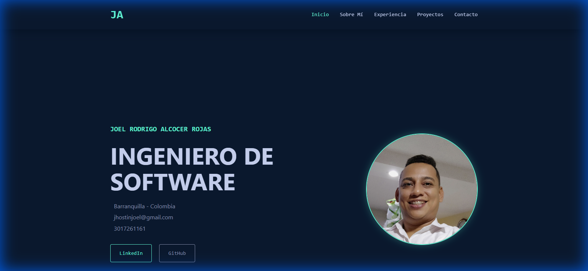
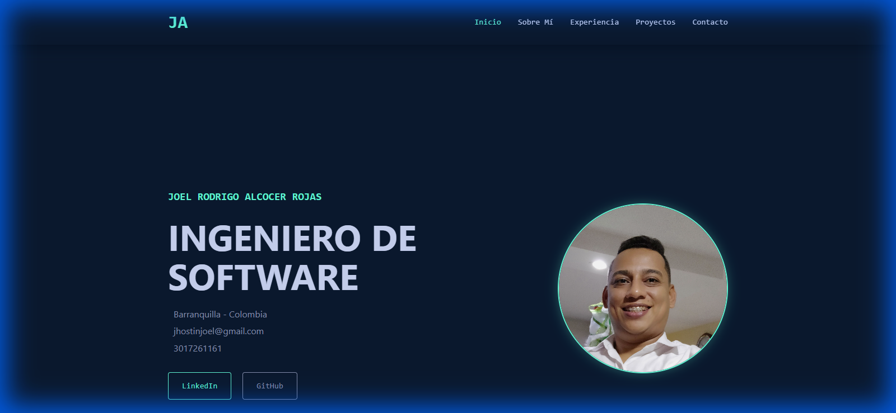

# Mi Portafolio - Joel Rodrigo Alcocer Rojas

Portafolio profesional desarrollado con React que muestra mi experiencia, habilidades y proyectos como Ingeniero de Software especializado en desarrollo Oracle.

## 🚀 Características

- **Diseño Moderno**: Interfaz profesional con tema oscuro y animaciones suaves
- **Responsive**: Adaptado para dispositivos móviles, tablets y desktop
- **Componentes Modulares**: Arquitectura basada en componentes reutilizables
- **Navegación Dinámica**: Sistema de navegación por secciones
- **Información Actualizada**: CV completo con experiencia laboral y formación académica

## 📸 Capturas de Pantalla

### Sección Principal (Hero)


### Sobre Mí


## 📋 Requisitos Previos

Antes de comenzar, asegúrate de tener instalado:

- [Node.js](https://nodejs.org/) (versión 14 o superior)
- [npm](https://www.npmjs.com/) (viene incluido con Node.js)
- [Git](https://git-scm.com/)

## 🔧 Instalación

Sigue estos pasos para configurar el proyecto en tu máquina local:

### 1. Clonar el repositorio

```bash
git clone https://github.com/JhostinJoel/Mi_Portafolio.git
cd Mi_Portafolio
```

### 2. Instalar dependencias

```bash
npm install
```

### 3. Ejecutar en modo desarrollo

```bash
npm start
```

La aplicación se abrirá automáticamente en [http://localhost:3000](http://localhost:3000)

## 📦 Scripts Disponibles

### `npm start`
Ejecuta la aplicación en modo desarrollo.
- Abre [http://localhost:3000](http://localhost:3000) en tu navegador
- La página se recarga automáticamente al hacer cambios
- Los errores de lint aparecen en la consola

### `npm run build`
Construye la aplicación para producción en la carpeta `build`.
- Optimiza React para mejor rendimiento
- Los archivos se minifican y los nombres incluyen hashes
- La aplicación está lista para ser desplegada

### `npm test`
Ejecuta las pruebas en modo interactivo.

## 🏗️ Estructura del Proyecto

```
Mi_Portafolio/
├── public/
│   └── index.html          # Plantilla HTML principal
├── src/
│   ├── components/         # Componentes React
│   │   ├── Header.js       # Navegación
│   │   ├── Hero.js         # Sección principal
│   │   ├── About.js        # Sobre mí
│   │   ├── Experience.js   # Experiencia laboral
│   │   ├── Education.js    # Formación académica
│   │   ├── Skills.js       # Habilidades técnicas
│   │   ├── Projects.js     # Proyectos
│   │   ├── Contact.js      # Información de contacto
│   │   └── Footer.js       # Pie de página
│   ├── data/
│   │   └── resume.js       # Datos del CV (fácil de actualizar)
│   ├── assets/
│   │   └── perfil.jpg      # Foto de perfil
│   ├── App.js              # Componente principal
│   ├── App.css             # Estilos globales
│   └── index.js            # Punto de entrada
├── package.json
└── README.md
```

## ✏️ Personalización

### Actualizar tu información

Edita el archivo `src/data/resume.js` para actualizar:
- Información personal y de contacto
- Experiencia laboral
- Formación académica
- Habilidades técnicas y blandas
- Referencias

### Cambiar la foto de perfil

Reemplaza `src/assets/perfil.jpg` con tu propia foto.

### Modificar estilos

Los estilos principales están en `src/App.css`. Puedes personalizar:
- Colores (variables CSS en `:root`)
- Tipografía
- Espaciados y tamaños

## 🌐 Despliegue

### Opción 1: GitHub Pages

1. Actualiza el campo `homepage` en `package.json`:
```json
"homepage": "https://jhostinjoel.github.io/Mi_Portafolio"
```

2. Instala gh-pages:
```bash
npm install --save-dev gh-pages
```

3. Agrega scripts de deploy en `package.json`:
```json
"scripts": {
  "predeploy": "npm run build",
  "deploy": "gh-pages -d build"
}
```

4. Despliega:
```bash
npm run deploy
```

### Opción 2: Netlify

1. Construye el proyecto:
```bash
npm run build
```

2. Arrastra la carpeta `build` a [Netlify Drop](https://app.netlify.com/drop)

### Opción 3: Vercel

1. Instala Vercel CLI:
```bash
npm i -g vercel
```

2. Despliega:
```bash
vercel
```

### Opción 4: 000webhost

Consulta el archivo [DEPLOY.md](DEPLOY.md) para instrucciones detalladas de despliegue en 000webhost.

## 🛠️ Tecnologías Utilizadas

- **React** 18.3.1 - Biblioteca de JavaScript para interfaces de usuario
- **React Icons** - Iconos para habilidades y contacto
- **Font Awesome** - Iconos de redes sociales
- **CSS3** - Estilos y animaciones

## 📧 Contacto

- **Email**: jhostinjoel@gmail.com
- **LinkedIn**: [Joel Rodrigo Alcocer Rojas](http://linkedin.com/in/joel-rodrigo-alcocer-rojas-b640b6212/)
- **GitHub**: [JhostinJoel](https://github.com/JhostinJoel)
- **Ubicación**: Barranquilla, Colombia

## 📄 Licencia

Este proyecto es de código abierto y está disponible bajo la licencia MIT.

## 🙏 Agradecimientos

Proyecto creado con [Create React App](https://github.com/facebook/create-react-app).

---

⭐ Si te gusta este proyecto, ¡dale una estrella en GitHub!
